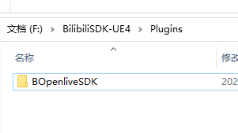
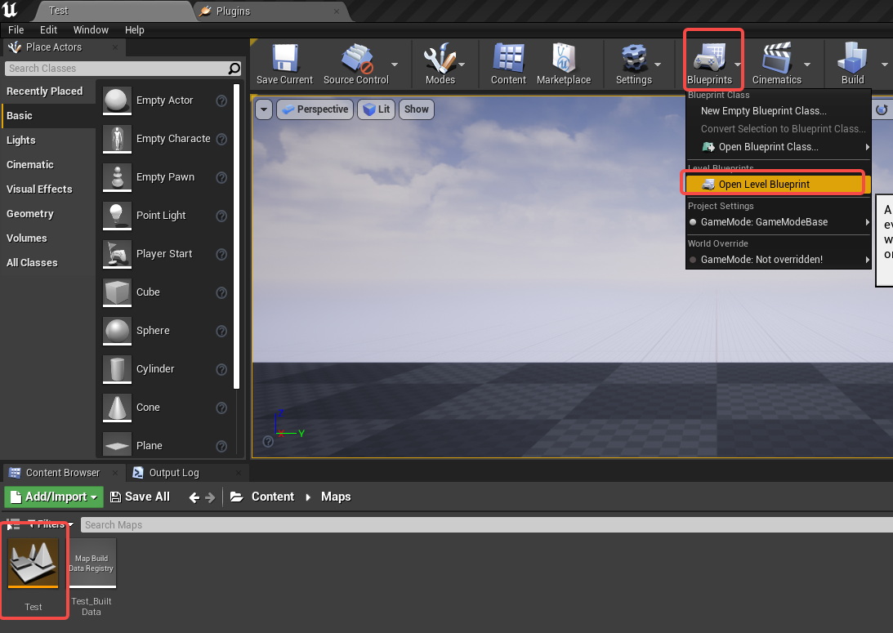

# BOpenliveSDK-UE4
Blibili live live bullet screen interaction official interface
- Unity next door has an SDK, we have to have one too
- At present, the implemented interfaces include: initialize parameters, start the game, close the game, and realize notification messages such as bullet screen message, gift message, SC message, SC withdraw message, and captain message
- Internal implementation of WebSocket automatic reconnection mechanism, without additional developer operation can be automatically reconnected
- Pure C++ code plug-in, the core code is used in native C++ code, if you want to refer to this plug-in port to other C++ platform is also very easy

## Plug-in Access Process (Graphic tutorial)
1. Copy the Plugins\BOpenliveSDK folder from this sample project into your own project's Plugin directory
   
2. That's it. That's easy

## Access completed, is not very easy plug-in use tutorial (graphic tutorial)
1. The example of the use of this plug-in interface, in the level blueprint of the default level (Test), can be written into your own project according to the actual situation of your project
   
2. This plug-in using the singleton pattern, so the function you need to use GetInstancePtr function, called after the Init function, the incoming Keyid, KeySecret, Appid and Code, after binding each news event, the required message bindings, Start function called again can open long chain
   
   
3. At the end of the game, or if you need to, you need to call the Stop function to close the current long chain
   

## Plug-in directory structure introduction
1. Tool folder: contains JSON library and hash library found from the Internet
2. BApi.cpp：Encapsulates the HTTP interface
3. BApiInfo.cpp：Structures that encapsulate Bilibili's live barrage data, but also expose these structures to blueprints
4. BOpenliveSDK.cpp：New plugin files, no specific role
5. BOpenliveSDKBPLibrary.cpp：The main process class, which also exposes functions and messages to the blueprint
6. BWebsocket.cpp：Encapsulates UE's own websocket, which is mainly used to establish B webmaster chain, receive and send Websocket data
7. See the comments in the code for more details, and I'll add as many comments as I can

## Notes
1. FStartErrorEvent This message is when the long chain is opened. If the long chain fails to be opened, this message will be sent. When the developer receives this message, it can prompt a network error in a pop-up window
2. After the long link is successfully enabled, the plugin automatically handles the reconnection function without the need for the developer to perform any additional operations
3. Since the core code is in native C++, UE itself is only used where necessary, so in theory this plugin should work for most UE versions. I tested it on version 4.27, and you can raise Issues if you have problems with other versions
4. At present, the latest version is compiled with UE5 DLL, UE5 project can directly copy the plug-in into the project for use, other versions need to be compiled with VS project to use

## special acknowledgement
item reference：https://github.com/CXHGT/BilibiliSdkDemo

This plug-in is a port based on the project, while increasing the robustness of the code，
